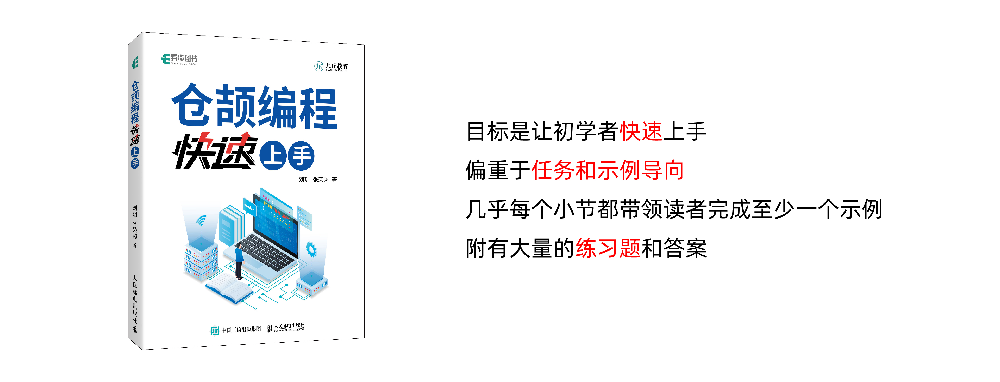
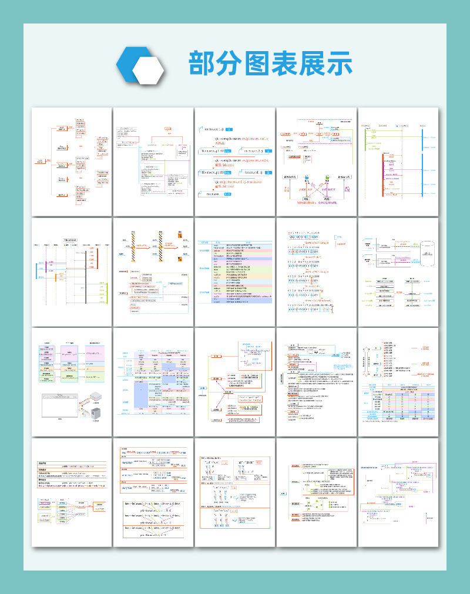
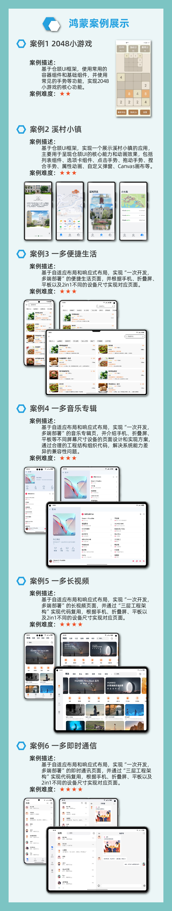
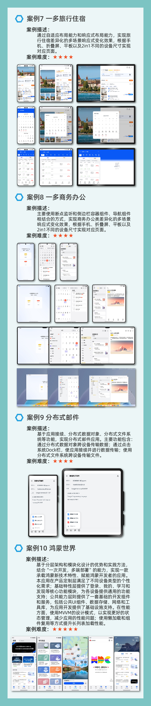
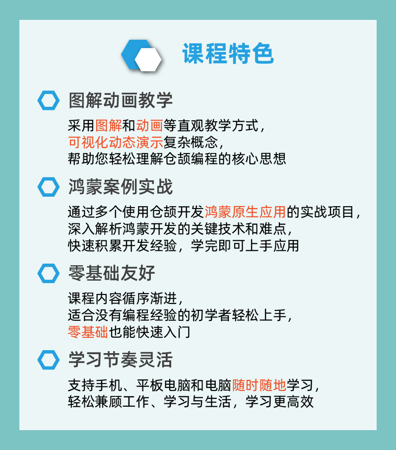
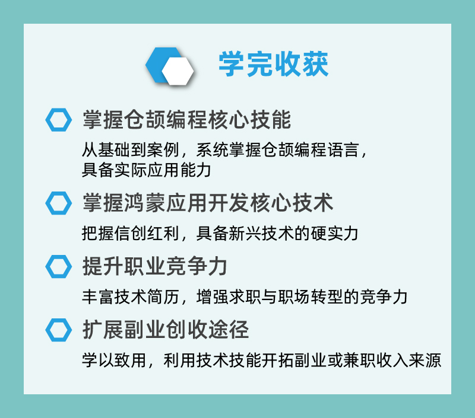
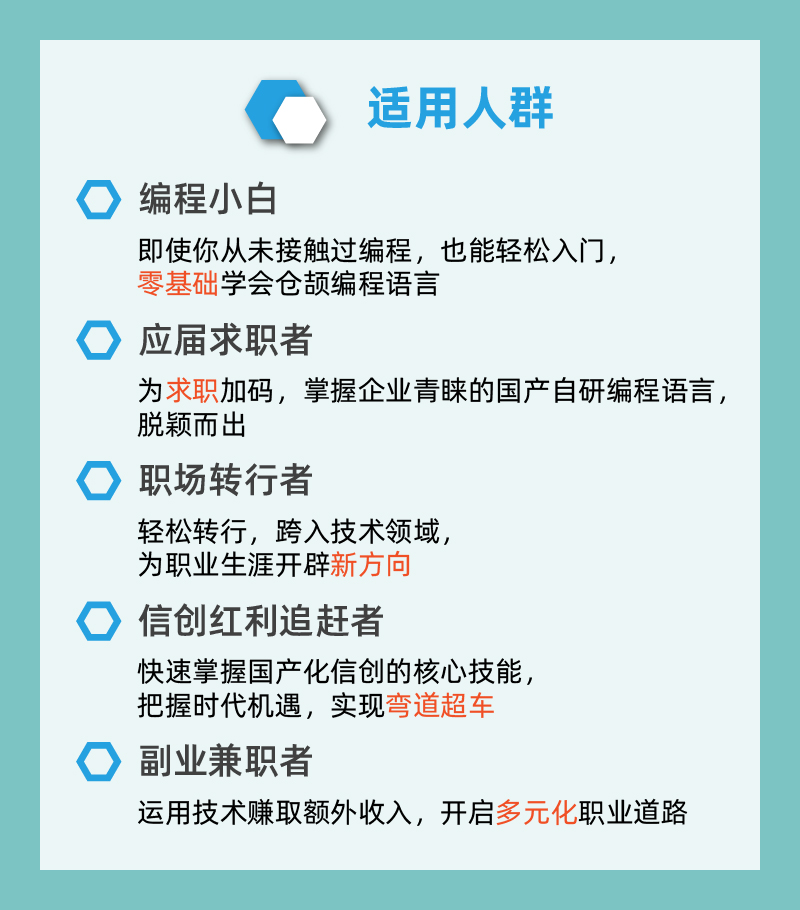
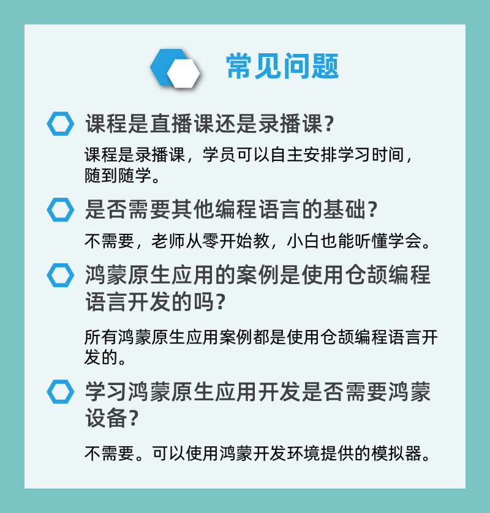

# 仓颉图书
 
 
  
<a href="https://item.jd.com/14670056.html" target="_blank">**图书链接：《图解仓颉编程：基础篇》**</a> 
<a href="https://item.jd.com/14670040.html" target="_blank">**图书链接：《图解仓颉编程：高级篇》**</a> 
<a href="https://item.jd.com/14200757.html" target="_blank">**图书链接：《仓颉编程快速上手》**</a>  

# 视频课程（仓颉+鸿蒙）
**《图解仓颉编程视频课程》从零开始教，以图解和动画的形式，超细致讲解仓颉编程语言，并通过10个典型的鸿蒙App案例，手把手教你使用仓颉开发鸿蒙App，助你快速掌握仓颉和鸿蒙的核心开发技能！**   
  
  
  
  
  
  
  
  
   

# 交个朋友
